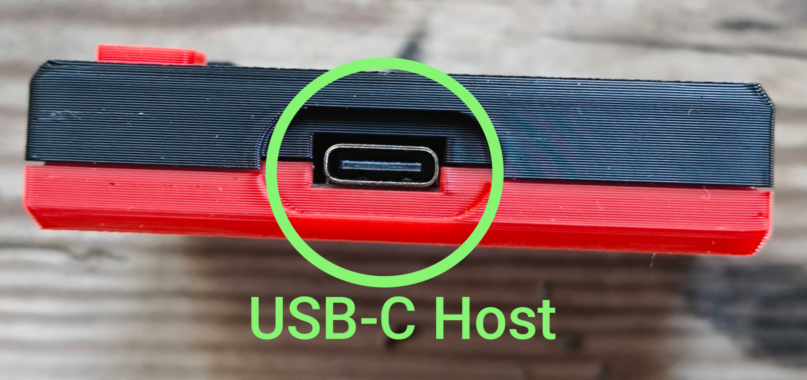
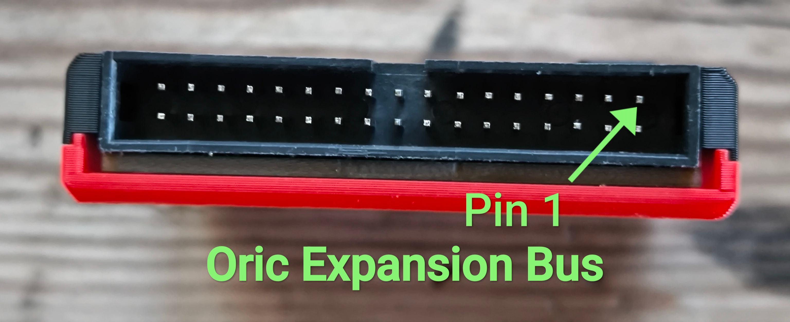
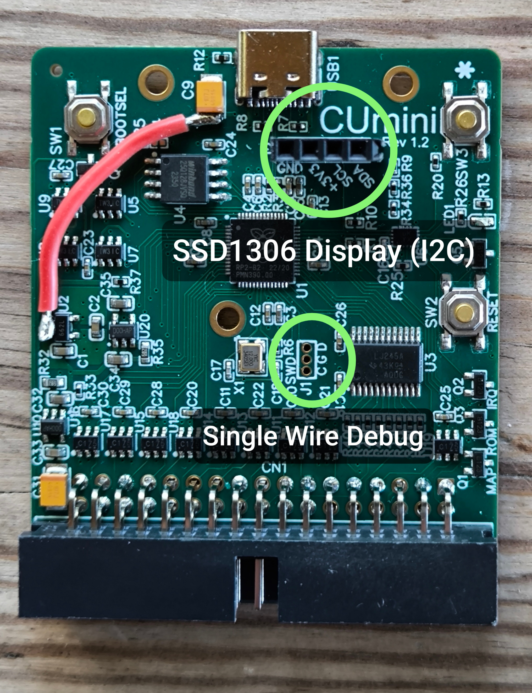
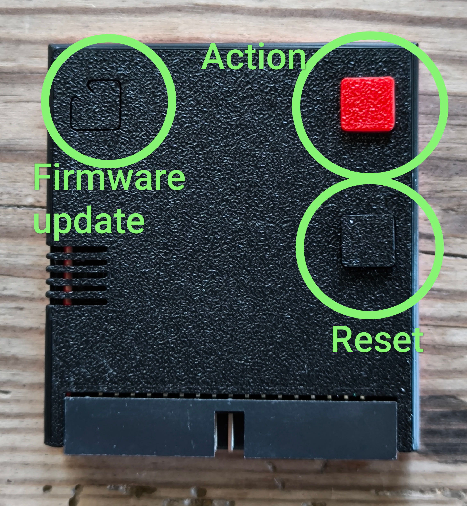

# Oric LOCI Batch #01 Supplement 
LOCI - Lovely Oric Computer Interface

A condensed technical overview and tester guide for the first batch of Oric LOCI devices in July 2024. This is shared in Document form ahead of establishing Github repositories.
## Device overview
LOCI is an expansion device for Oric computers and primarily provides ROM and storage emulation of floppy and cassette devices. Secondarily features are device expansion over USB for simple HID (e.g. mouse, keyboard, game controllers) and CDC (serial, serial modem) devices.

LOCI comes with two physical user connectors: one 34p IDC connector for connecting to the Oric expansion port, and one USB-C connector for connecting USB devices. LOCI is a USB host that can accept a subset of USB devices, but not connect directly to other USB masters, like computers, during normal operation.

The board also includes two debug connectors: one I2C connector primarily for connecting an SSD1306 display, and one SWD connector for accessing the RP2040 internal state. These are typically not needed in normal use, and are not exposed when the case is used.

The board and the standard case exposes three buttons
1. Action - a software defined button for the user to interact with LOCI. This is the red or white button on the case, depending on style.
2. Reset - a hardware reset button for the Oric. It does not directly interact with the LOCI firmware. This is the black button.
3. Firmware - this is for upgrading the MCU firmware. This is the “hidden” button on the case.

## Power
LOCI does not have a separate power connector, but instead uses the integrated power available in the user connectors. So it can be powered from either the Oric expansion port, or the USB-C port. 

When LOCI is powered over the Oric expansion port, the USB bus is also powered by Oric. In this case, avoid using power hungry USB devices like spinning HDDs as it may cause overheating and damage to the Oric power regulator.

The original Oric power adapter is only rated for powering the 600mA used by Oric itself. It may not work with LOCI or any other expansion device needing more than maybe 50mA. A modern -9V rated for 1A or more is recommended for powering an Oric with LOCI and a few reasonable USB devices when powered over the Oric expansion bus.

When LOCI is powered over the USB-C port (e.g by a powered USB hub), it will disconnect the power connection to the expansion port (and Oric) for safety reasons. This means Oric will not be powered from the USB bus but always needs its own power supply. In this case the original Oric power adaptor should work fine.

## What to expect
LOCI operates in two different modes, “Reset” and “Run”.
* Reset: Oric is held in reset and a command line monitor on LOCI is accessible via a USB serial adapter.
* Run: Oric is executing, with LOCI in control of the page 3 I/O memory space and the ROM memory space.

Because we are still developing the FW and ROM, LOCI currently starts in Reset mode and we use the action button to toggle between the two modes. So when powering on, Oric is held in reset and we click the action button once to turn to Run mode.

When LOCI switches to Run mode it will map in the LOCI ROM and boot it, and Oric will present the LOCI configuration screen. When we exit the LOCI ROM (Esc key), LOCI changes to ROM mapping to the configured setup and runs it, typically starting Microdics ROM for floppy use or Basic11 ROM for tape use.

To return to the LOCI ROM later, click the action button twice (1st = reset, 2nd = run).

The current LOCI ROM is in an in-between state after experimenting with building a TUI. There are many graphical elements still shown that have no interaction or use, other than TUI testing.

## Using the LOCI ROM
The LOCI ROM is mapped in and executed when the user pushes the Action button. It allows for the configuration of the LOCI emulation functions by keyboard navigation.
Keyboard mapping:
* Arrows up/down:	Move between menu items
* Space:			Select file or toggle current menu item
* Esc:			Exit current popup, or boot if at the top menu
Other keys may be in active use for in-development features or debug functionality and give undefined results/behavior.

There is no dedicated eject/unmount menu element at the moment, but pressing Space after the file selection dialog shows, but before navigating to any directory items, will unmount the previous mounted file without mounting a new.

## Using the command line monitor
When LOCI is in Reset state, there is a serial terminal command line interface available over USB for advanced control of LOCI. Due to the design constraints of the hardware it is however a little difficult to set up.

It requires either:
* A USB to RS232 adapter and a computer/terminal with physical RS232 port
or
* A USB to USB serial null modem, either as a dedicated device or by using two USB to RS232 adapters with a null modem cable/converter in between.

The USB to RS232 adapters also need to work with TinyUSB in host mode.
<TODO add known working device list>

Currently the command line monitor has not been expanded with the Oric features yet, and the original RP6502 command set is active, although not always relevant.

## Known problems or limitations
### HW
* VBUS power distribution switch hinders power going out to USB devices. Rev 1.2 boards have bodge wires to fix this so testing devices should operate correctly.

### FW
* Action button is not debounced. Holding it pushed will give repeated toggling actions.
* Switching from LOCI to Oric ROMs isn’t always successful. Could be insufficient reset time or missing initialisations. Manually pressing the reset button usually resolves this.
* File management: Read-only attributes have not been implemented. All files are writable.
* Floppy emulation: No CRC functionality has been implemented. Currently just a minimum of FDC commands have been implemented, like seek, read and write sector.
* Tape emulation: No write functionality implemented. Only CLOAD patch for Basic 1.1 in place.
* TinyUSB is the USB stack used in LOCI. It has limits to its device support, so not all USB devices will automatically work.

### ROM
* Back traversing of directories is broken. This bug got introduced with the addition of a root listing of all USB devices.
* Stand-alone mode (no USB device) is currently broken. Something in the device and directory traversing hangs when there are no USB storage devices connected.
* Just a minimum of functionality in place so far: Turn on/off floppy and tape emulation, navigate and select DSK and TAP files that are mounted.

### Software
* Space1999 stops loading after HUD has been loaded, before isometric view/game is loaded/executed.

### Firmware update
The firmware comes in a UF2 format file and no special tools or software is needed to install it. To update the LOCI firmware you need a computer and a USB cable to connect LOCI to the computer. It’s the same procedure as Rasberry Pi Pico updating.
1. Disconnect LOCI from Oric and USB devices
2. Connect the cable to the computer first
3. Hold down the Firmware button on LOCI
4. Connect LOCI to the cable
5. Release the Firmware button
The LOCI LED should not light up
6. LOCI shows as a USB storage device on the computer. Mount it if necessary.
7. On the computer, copy the UF2 file to the mounted storage device and wait
When the LOCI LED lights up, the process is complete and successful
8. Disconnect the cable

## Testing
While testers are free to do what they like, here are a couple of ideas and guidelines for what can help us improve LOCI for possibly higher success with a wider audience.

### Goal #1 - Physical layer robustness
While the emulation and interaction software is still in development, the lower level of hardware and firmware responsible for providing a robust communication layer between LOCI and an Oric computer, is considered relatively mature but with limited (1 machine) testing. A goal for the test run is to find the edges of robustness, cases where it goes unstable and wrong, so that we can investigate, resolve and improve the robustness of this layer of the design.
This can mean
* Trying LOCI on different Oric machines
* Switching different lengths of cables
* Trying different Oric power supplies

### Goal #2 - Software compatibility testing
The emulation of FDC, tape, memory bank switching etc seem to be working quite well for average software titles but it's of high interest to identify titles, software or combinations that fail. We will use this information to prioritize investigations, feature development and bug fixing.

### Tester packs
Each tester pack consist of
* 1x Standard Oric LOCI in Atmos black/red colored case
* 1x Debug Oric LOCI without case, with display header 
* 1x SSD1306 OLED display (white or blue/yellow)
* 1x White case bottom shell
* 1x White case button

The SSD1306 display connects to the I2C display header on the Debug LOCI. Please take care to align the pins to the header correctly. The display is used to display additional information during execution as a simple additional information path for debugging. Apart from the case and the connected display, there is no difference in HW or FW between the standard and debug devices.

The extra case parts are cosmetic. They allow changing the case style from Atmos (black/red) to Oric-1(black/white).

